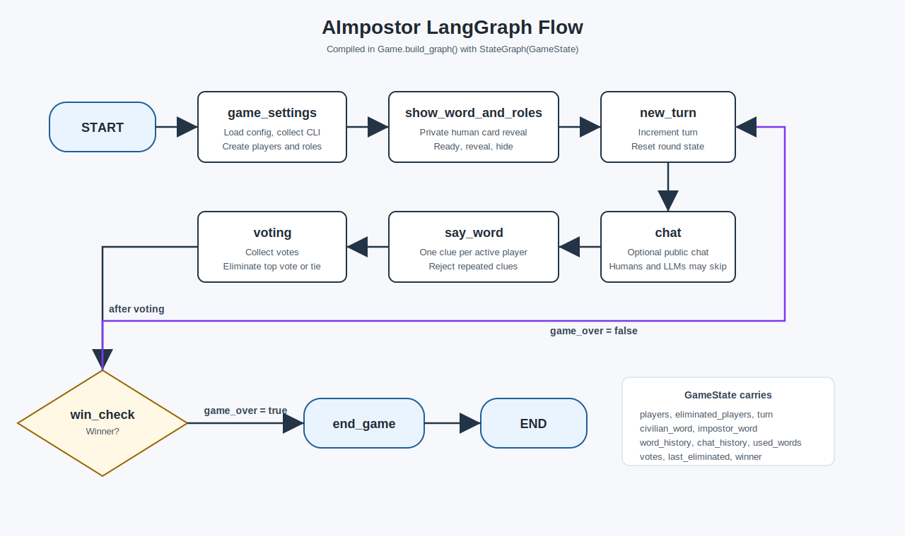
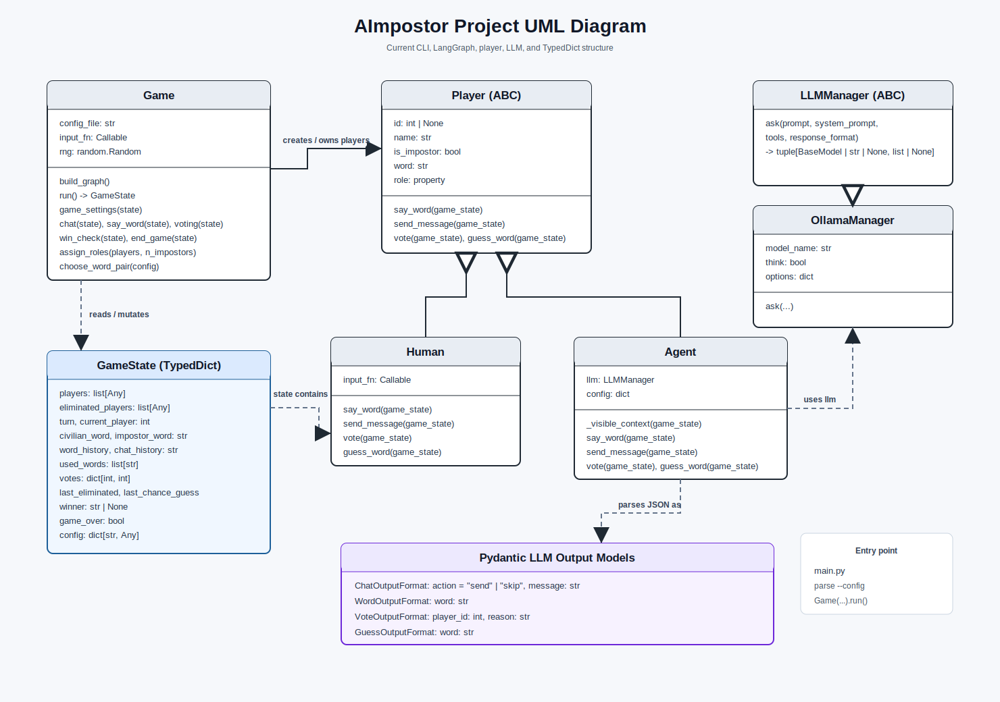

# AImpostor

AImpostor is a command-line implementation of the Impostor word game. The game logic is orchestrated with LangGraph, while players, LLM providers, configuration, and data types are separated into small modules to keep the project easy to extend.

## Running

Install dependencies in the project virtual environment:

```bash
venv/bin/pip install -r requirements.txt
```

Run the game:

```bash
venv/bin/python main.py
```

The default settings are loaded from `config.json`.

## How LangGraph Works Here

LangGraph models the game as a state machine. In this project, [game.py](game.py) builds a `StateGraph(GameState)` where every node is a Python function that receives the current game state and returns the updated state.

Current graph structure:

```text
START
-> game_settings
-> show_word_and_roles
-> new_turn
-> chat
-> say_word
-> voting
-> win_check
-> new_turn | end_game
-> END
```

The important concepts are:

- **Node**: a function that implements one phase of the game, for example `chat`, `say_word`, or `voting`.
- **State**: the `GameState` object passed from node to node. Each node reads and updates this shared state.
- **Edge**: a connection that defines which node runs next.
- **Conditional edge**: a routing function can decide the next node based on state. For example, after `win_check`, the graph either goes to `end_game` or loops back to `new_turn`.




## Modular Project Structure

The project is structured around interfaces and small responsibilities. This is useful because it makes the code modular: a new implementation can be added by extending the right abstract class instead of rewriting the game logic.

For example, [utils/llm_manager.py](utils/llm_manager.py) defines the `LLMManager` abstract interface:

```python
class LLMManager(ABC):
    @abstractmethod
    def ask(...):
        pass
```

[ollama_manager.py](ollama_manager.py) implements that interface for Ollama. If you wanted to add another LLM framework or provider, you would create a new class that extends `LLMManager` and implements `ask`. The rest of the game can keep using the same public endpoint.

The same idea is used for players. [utils/player.py](utils/player.py) defines the `Player` interface with shared endpoints:

- `say_word(game_state)`
- `send_message(game_state)`
- `vote(game_state)`
- `guess_word(game_state)`

[human.py](human.py) and [agent.py](agent.py) both implement `Player`, but in different ways:

- `Human` asks for command-line input.
- `Agent` asks the LLM and parses structured responses.

This is a good example of why abstract interfaces are useful: the game loop does not need to know whether a player is human or AI. It only calls the same player methods.



## Configuration

The [config.json](config.json) file contains the configurable parts of the game:

- Ollama model settings
- word pairs
- max turns
- chat settings
- prompt templates
- display templates
- role reveal format

Keeping these values in a config file is useful because it separates game behavior and prompt tuning from Python code. You can adjust model parameters, prompts, word pairs, or display strings without changing the implementation.

## Data Types

[utils/data_types.py](utils/data_types.py) is important because it defines the shared data contracts of the project.

It contains:

- `GameState`, a `TypedDict` used by LangGraph as the state passed between nodes.
- Pydantic models for structured LLM outputs:
  - `ChatOutputFormat`
  - `WordOutputFormat`
  - `VoteOutputFormat`
  - `GuessOutputFormat`

Using these types keeps the graph state explicit and makes LLM responses easier to validate. The game can ask an agent for a clue, vote, chat message, or guess and parse the result into a predictable object instead of relying on free-form text.
